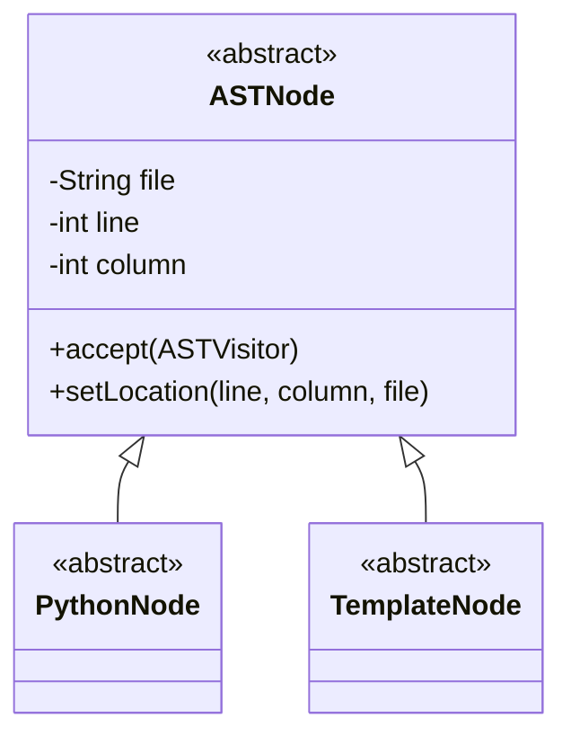
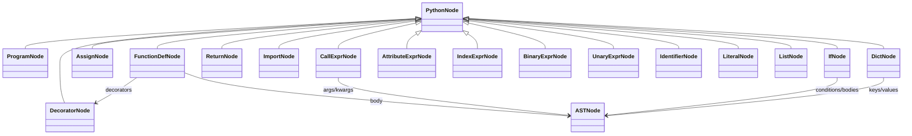
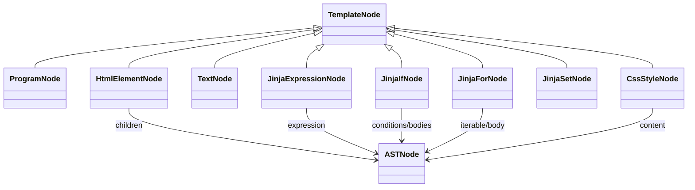
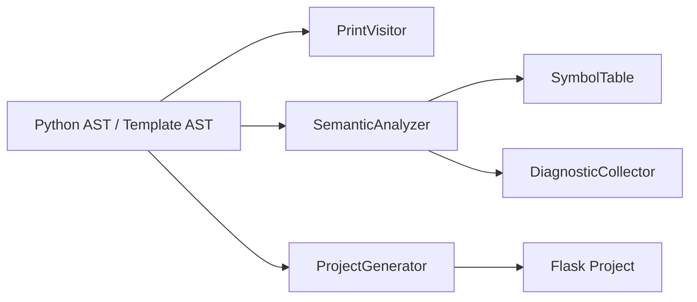

# مخطط شجرتي AST

ينتج المشروع شجرتين مستقلتين: Python AST وTemplate AST. جميع العقد ترث من `ASTNode` وتحفظ `fileName`, `line`, و`column`، وتنفذ التابع `accept` لتطبيق Visitor Pattern.

## البنية العامة

## Python AST

## Template AST

## الزوار

- `PrintVisitor`: يطبع كل عقدة وأبناءها والموقع.
- `SemanticAnalyzer`: يبني جدول الرموز ويكتشف الأخطاء.
- `ProjectGenerator`: يعيد توليد Python وHTML/Jinja من الشجرتين.
